# Breakdown of the `moneroc` Process

So, lets just say we have 100 XMR in Account 0 which we will distribute in intervals of 10 XMR:

1. **Account Fund Distribution:**
   * Account 0 has 100 XMR.
   * It will send 10 XMR to each of the newly created accounts (10 new accounts) one by one with a `delayRange` in between each distribution.

Distribution Process:
```
Account 0 - 100 XMR

Account 0 -> Account 1: 10 XMR
wait 30-60 minutes
Account 0 -> Account 2: 10 XMR
wait 30-60 minutes
Account 0 -> Account 3: 10 XMR
wait 30-60 minutes
Account 0 -> Account 4: 10 XMR
wait 30-60 minutes
Account 0 -> Account 5: 10 XMR
wait 30-60 minutes
Account 0 -> Account 6: 10 XMR
wait 30-60 minutes
Account 0 -> Account 7: 10 XMR
wait 30-60 minutes
Account 0 -> Account 8: 10 XMR
wait 30-60 minutes
Account 0 -> Account 9: 10 XMR
wait 30-60 minutes
Account 0 -> Account 10: 10 XMR
```

2. **Churning Process**:
   * After distribution, accounts with non-zero balances (Account 1 to Account 10 in this context/example) are selected for churning.
   * Each account moves its funds to a newly created account (Account 11 to Account 20 in this context/example), with random delays between each transaction.

**NOTE: This is just 1 churn, there are more churns**

Churning Process:
```
Account 1 -> Account 11
wait 30-60 minutes
Account 2 -> Account 12
wait 30-60 minutes
Account 3 -> Account 13
wait 30-60 minutes
Account 4 -> Account 14
wait 30-60 minutes
Account 5 -> Account 15
wait 30-60 minutes
Account 6 -> Account 16
wait 30-60 minutes
Account 7 -> Account 17
wait 30-60 minutes
Account 8 -> Account 18
wait 30-60 minutes
Account 9 -> Account 19
wait 30-60 minutes
Account 10 -> Account 20
```

# Conceptual Visual Representation

```mermaid
classDiagram
    class Churning1 {
        The main churning process.
        +getAccounts()
        +churn()
        +randomDelay()
    }
    class Churning2 {
        The main churning process.
        +getAccounts()
        +churn()
        +randomDelay()
    }
    class Churning3 {
        The main churning process.
        +getAccounts()
        +churn()
        +randomDelay()
    }
    class Churning4 {
        The main churning process.
        +getAccounts()
        +churn()
        +randomDelay()
    }
    class Churning5 {
        The main churning process.
        +getAccounts()
        +churn()
        +randomDelay()
    }
    class Churning6 {
        The main churning process.
        +getAccounts()
        +churn()
        +randomDelay()
    }
    class Churning7 {
        The main churning process.
        +getAccounts()
        +churn()
        +randomDelay()
    }
    class Churning8 {
        The main churning process.
        +getAccounts()
        +churn()
        +randomDelay()
    }
    class Churning9 {
        The main churning process.
        +getAccounts()
        +churn()
        +randomDelay()
    }
    class Churning10 {
        The main churning process.
        +getAccounts()
        +churn()
        +randomDelay()
    }

    class Account0 {
        XMR = 100
        +getBalance()
        +waitForBalance()
        +createAccount()
        +transfer()
    }

    class Account1 {
        XMR = 10
    }

    class Account2 {
        XMR = 10
    }

    class Account3 {
        XMR = 10
    }

    class Account4 {
        XMR = 10
    }

    class Account5 {
        XMR = 10
    }

    class Account6 {
        XMR = 10
    }

    class Account7 {
        XMR = 10
    }

    class Account8 {
        XMR = 10
    }

    class Account9 {
        XMR = 10
    }

    class Account10 {
        XMR = 10
    }

    class Account11 {
        XMR = 10
    }

    class Account12 {
        XMR = 10
    }

    class Account13 {
        XMR = 10
    }

    class Account14 {
        XMR = 10
    }

    class Account15 {
        XMR = 10
    }

    class Account16 {
        XMR = 10
    }

    class Account17 {
        XMR = 10
    }

    class Account18 {
        XMR = 10
    }

    class Account19 {
        XMR = 10
    }

    class Account20 {
        XMR = 10
    }

    Account0 --> Account1 : distributes XMR
    Account0 --> Account2 : distributes XMR
    Account0 --> Account3 : distributes XMR
    Account0 --> Account4 : distributes XMR
    Account0 --> Account5 : distributes XMR
    Account0 --> Account6 : distributes XMR
    Account0 --> Account7 : distributes XMR
    Account0 --> Account8 : distributes XMR
    Account0 --> Account9 : distributes XMR
    Account0 --> Account10 : distributes XMR

    Account1 --> Churning1 : undergoes
    Account2 --> Churning2 : undergoes
    Account3 --> Churning3 : undergoes
    Account4 --> Churning4 : undergoes
    Account5 --> Churning5 : undergoes
    Account6 --> Churning6 : undergoes
    Account7 --> Churning7 : undergoes
    Account8 --> Churning8 : undergoes
    Account9 --> Churning9 : undergoes
    Account10 --> Churning10 : undergoes

    Churning1 --> Account11 : transfers to
    Churning2 --> Account12 : transfers to
    Churning3 --> Account13 : transfers to
    Churning4 --> Account14 : transfers to
    Churning5 --> Account15 : transfers to
    Churning6 --> Account16 : transfers to
    Churning7 --> Account17 : transfers to
    Churning8 --> Account18 : transfers to
    Churning9 --> Account19 : transfers to
    Churning 10 --> Account20 : transfers to
```



# Reality
### When you run moneroc:


